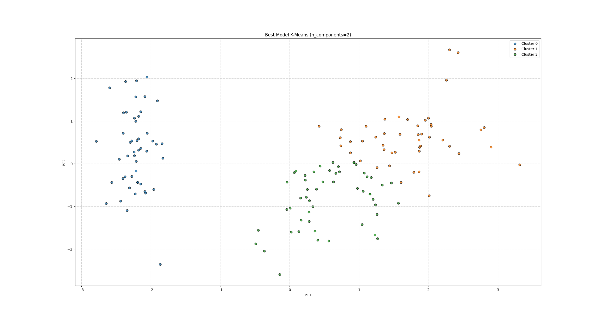

### Auto Cluster Tool
> A general-purpose unsupervised ML pipeline that automatically selects the best clustering algorithm for any dataset - no manual tuning required.


## Overview -
Most clustering workflows require domain expertise to pick the right algorithm 
and tune its parameters. Auto Cluster Tool eliminates that bottleneck by 
automatically selecting and tuning the best algorithm for any dataset.

## Features
- Automatic algorithm selection (DBSCAN, GMM, KMeans, Agglomerative)
- Hopkins Statistic to detect if data is even clusterable
- Auto-tuned hyperparameters (eps via KneeLocator, k via BIC)
- Model comparison via Silhouette + Davies-Bouldin scoring
- EDA module with distribution, correlation, and outlier analysis
- Works on any CSV dataset — no code changes needed

## Architecture
 
Input CSV → Load & Validate → EDA → Preprocessing → Feature Engineering
    → Hopkins Check → Density Sweep → Run All Algorithms → Score & Select → Plot

## Tech Stack
 
| Tool | Purpose |
|------|---------|
| Python 3.10 | Core language |
| scikit-learn | ML algorithms and metrics |
| pandas / numpy | Data manipulation |
| matplotlib / seaborn | Visualization |
| kneed | Automatic knee detection for DBSCAN |


## Project Structure
```markdown 
Auto-Cluster-Tool/
├── data/
│   ├── load.py               # CSV loading and validation
│   └── processed_data.py     # Preprocessing pipeline
├── src/
│   ├── eda/
│   │   └── eda.py            # EDA module
│   ├── features/
│   │   └── feature_engineering.py
│   ├── models/
│   │   ├── dbscan.py
│   │   ├── gmm.py
│   │   ├── kmeans.py
│   │   ├── agglomerative.py
│   │   └── auto_cluster.py   # Main selector
│   ├── evaluation/
│   │   └── metrics.py
│   └── visualization/
│       └── plots.py
├── main.py
├── requirements.txt
└── README.md
```

## Installation
 
1. Clone the repository
```markdown
git clone https://github.com/yourusername/auto-cluster-tool.git
cd auto-cluster-tool
 ```

2. Create a virtual environment
```markdown
python -m venv venv
venv\Scripts\activate        # Windows
source venv/bin/activate     # Mac/Linux
```

3. Install dependencies
```markdown
pip install -r requirements.txt
```

## Usage
 
1. Add your CSV file anywhere on your system
2. Update the path in main.py:
```markdown
if __name__ == "__main__":
    main(path='path/to/your/dataset.csv', show_eda=True)
```
3. Run:
python main.py
 
The tool will automatically:
- Run EDA on your data
- Select the best clustering algorithm
- Print model comparison scores
- Display cluster visualization

## Results
 
### Model Comparison on Iris Dataset
| Model | Silhouette | Davies-Bouldin | Calinski_Harabasz |
|-------|------------|----------------|-------------------|
| KMeans | 0.4610 | 0.8352 | 242.59 |
| GMM | 0.3734 | 1.0912 | 186.46 | 
| Agglomerative | 0.4596 | 0.8373 | 237.69 |
| **Winner** | **KMeans** | 
 


## Design Decisions
 
**Why PCA inside the pipeline, not feature engineering?**
PCA is algorithm-specific. DBSCAN benefits from dimensionality reduction 
to make density meaningful, but KMeans and GMM often perform better on 
the original scaled features. Keeping PCA inside each pipeline allows 
each algorithm to make its own decision.
 
**Why BIC for GMM instead of silhouette?**
BIC penalizes model complexity, preventing GMM from overfitting by 
adding unnecessary clusters. Silhouette alone would always prefer 
more clusters with tighter boundaries.
 
**Why combine Silhouette + Davies-Bouldin for model selection?**
Silhouette favors convex, equally-sized clusters (biased toward KMeans).
Davies-Bouldin has different geometric assumptions. Using both together 
cancels out individual biases for a fairer comparison.

## Limitations
- DBSCAN performs poorly on datasets with uniform density (e.g., wine dataset)
- Hopkins Statistic uses random sampling — results may vary slightly on small datasets
- Current EDA is exploratory only — no automated feature selection
- Not optimized for datasets with >100k rows

## Roadmap
- [ ] Docker containerization + FastAPI serving
- [ ] HDBSCAN support for variable density clustering  
- [ ] Interactive HTML report output
- [ ] Support for non-CSV formats (Excel, Parquet)
- [ ] Automated dataset profiling report